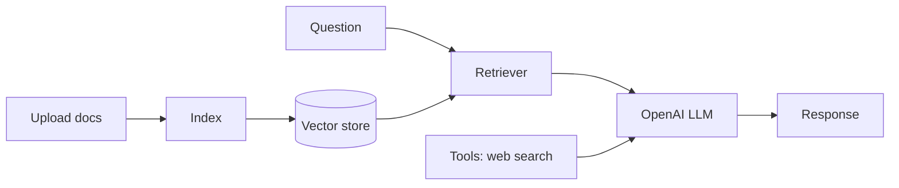

# RAG Document Q&A

A practice project for building a Retrieval-Augmented Generation (RAG)
assistant. Upload documents and ask questions about them; the backend retrieves
relevant passages and uses an LLM to answer. It also demonstrates simple tool
use (e.g. web search and a weather tool).

## Architecture

- **Backend** — FastAPI service (`BackEnd/`) handling document upload, retrieval
  (RAG), LLM responses, and tool calls.
- **Frontend** — lightweight HTML/CSS/JS UI (`FrontEnd/`) for chatting with the
  assistant.

## Tech Stack

- Python, FastAPI
- OpenAI API
- Tavily (web search tool)
- Vanilla HTML/CSS/JavaScript frontend

## Architecture



**Skills demonstrated:** building a retrieval pipeline behind a FastAPI service, combining RAG with tool use (web search), and wiring a simple frontend to an LLM backend.

## Setup

**Backend**
```bash
cd BackEnd
python -m venv .venv && source .venv/bin/activate   # Windows: .venv\Scripts\activate
pip install -r requirements.txt
cp .env.example .env      # add your OpenAI and Tavily keys
uvicorn main:app --reload
```

**Frontend**

Open `FrontEnd/index.html` in your browser (it calls the backend at
`http://localhost:8000`).

## Configuration

API keys are read from `BackEnd/.env` (git-ignored). See `.env.example`.
Uploaded documents in `BackEnd/Uploads/` are not tracked.

## License

Released under the [MIT License](LICENSE).
